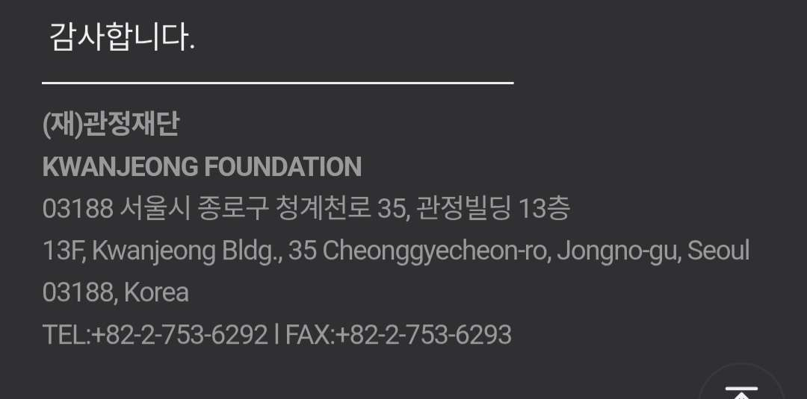

# 2025-12-27

생성자: 한성재 / 학생 / 전기·정보공학부 ­
회의 유형: 주간 회의

# 16회차 정기 회의

## 참여자

- 한성재
- 박성현
- 강명석
- 오현우

---

## 주간보고

### 물티슈 구매

- 청소했을 때 안 나옴
- **구매하자**
- **담당: 강명석**

### GTC 가입

- **가입 진행 중**
- 프로필 작성하고 신청하면 끝임

### 대청소 예산

- 크린토피아는 아직 빨래가 안 돼서 금액 안 나옴
- 회식비 영수증 올려뒀어요

### 라벨지 붙이기

- 살 예정이다.

### 마스코트 제작

- ?

### 손은석 선배

- 연락을 해보기로 함.
- **연락처 자체는 아직 안 옴.**
- NC, 한컴 연락처
- 한컴쪽 선배가 날아감.

---

## 이메일/인스타

### 현황1

---

## 구매건의

### 물티슈 구매

- 담당: 강명석

---

## 논의사항

### SCSC 이메일 포워딩

- 임원진들 대상 자동 포워딩.
- 있으면 편할 듯.
- **담당: 강명석**

### SCSC 이메일 바닥글

- 아래 사진과 같은 거
- **담당: 강명석**

### 신입회원 모집자료

- **할 사람이 부족하다.**
- TF 모집해도 괜찮지 않나.
- **김지훈한테 문의**

### 대청소때 나온 물품 처리

- 

- **1, 2번 다른 곳 보관**
- **3번 보존**
- **4번은 한 박스에 정리합시다**

### 보드게임, 책 등 무료 나눔

- **책은 확실히 버릴 거 (수험서 등등) 빼고는 보존**
- **책, 보드게임은 우선순위 대로 분류**

### 물품 스티커 구비

- 컴퓨터에 불일 **라벨지와 같이 구매**
- 앞으로는 동아리 차원에서 **물건 사면 붙이자**

---

## 남아있는 일

- 구매: 물티슈, 라벨지
- 청소 관련: 
파워 서플라이, 오실로스코프, 로직 애널라이저 → 다른 공간에 이동
포터블 모니터 → 보존
그 외 전자부품 → 한 박스에 몰아서 보존
책, 보드게임 → 확실히 필요없는 건 (고등 수험서 등) 버림, 그 외는 우선순위 분류
- 이메일 관련:
자동 포워딩, 바닥글 설정: 강명석 담당